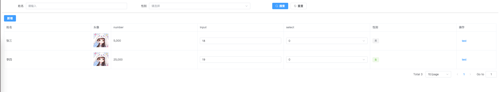

# vex-page

vue3 管理后台通用列表页面。Vue3 + Element Plus

## 安装

```bash
npm install vex-page
```

## 使用

```js
import VexPage, { setConfig } from 'vex-page' //导入
import 'vex-page/lib/style.css' //导入样式

// 设置配置文件
setConfig({
  pageSizeKey: 'pageSize',
  pageNumKey: 'pageNum',
  getList: res => res.data,
})
app.use(VexPage)
```

```vue
<template>
  <v-page
    :columns="columns"
    :btns="btns"
    :filter="filters"
    :get-list="getList"
    @test="test"
  />
</template>

<script setup>
import avatar from './avatar.js'

// 获取列表
const getList = () => {
  return new Promise((resolve) => {
    setTimeout(() => {
      resolve({
        data: [
          {
            id: 1,
            avatar,
            name: '张三',
            age: 18,
            gender: 0,
            select: 0,
            number: 5000,
            table: [
              {
                id: 1,
                name: '张三',
                age: 18,
                gender: 0,
                select: 0,
                number: 5000,
              }
            ]
          },
          {
            id: 2,
            avatar,
            name: '李四',
            age: 19,
            gender: 1,
            select: 0,
            number: 25000,
            table: [
              {
                id: 2,
                name: '李四',
                age: 19,
                gender: 1,
                select: 0,
                number: 25000,
              }
            ]
          },
        ],
        total: 3,
      })
    }, 1000)
  })
}

const gender = [
  { label: '男', value: 0, type: 'primary' },
  { label: '女', value: 1, type: 'success' },
]

const select = [
  { label: '0', value: 0, type: 'primary' },
  { label: '1', value: 1, type: 'success' },
]

const change = (row, value) => {
  console.log(row, value)
}

// 表格配置
const columns = [
  { label: '姓名', prop: 'name', },
  { label: '头像', prop: 'avatar', scope: 'img', width: 100 },
  { label: 'number', prop: 'number', scope: 'number-col' },
  { label: 'input', prop: 'age', scope: 'input', change },
  { label: 'select', prop: 'select', scope: 'select', options: select },
  { label: '性别', prop: 'gender', scope: 'tag', options: gender },

  // { label: '嵌套', prop: 'table', scope: 'table',
  //   options: [
  //     { label: '姓名', prop: 'name', },
  //     { label: 'number', prop: 'number', scope: 'number-col' },
  //     { label: 'input', prop: 'age', scope: 'input', change },
  //     { label: 'select', prop: 'select', scope: 'select', options: select },
  //     { label: '性别', prop: 'gender', scope: 'tag', options: gender },
  //   ]
  // },

  // 操作列
  {
    label: '操作',
    fixed: 'right',
    width: 200,
    scope: 'btn',
    options: [
      { text: 'test', event: 'test' }
    ]
  },
]

const test = (row) => {
  console.log(row)
}

const showAdd = () => {
}

const filters = [
  { label: '姓名', prop: 'name', type: 'input' },
  { label: '性别', prop: 'gender', type: 'select', options: gender },
]

// 按钮
const btns = [
  {
    text: '新增',
    click: showAdd
  },
]
</script>
```

## 效果



## setConfig

设置全局配置, 主要是分页时候参数以及获取方法

| 参数          | 说明     | 类型         | 默认值          |
|-------------|--------|------------|--------------|
| pageSizeKey | 分页参数   | _string_ | `pageSize`   |
| pageNumKey  | 分页参数   | _string_    | `pageNum`    |
| getList     | 获取列表方法 | _Function_ | `res => res.data` |
| getTotal    | 获取总数方法 | _Function_ | `res => res.total` |

## 组件

- [V-Page](./packages/v-page/doc.md)
- [V-Table](./packages/v-table/doc.md)
- [V-Element](./packages/v-element/doc.md)
- [V-Filter](./packages/v-filter/doc.md)

## table 支持scope类型

- img 图片
- number-col 数字
- input 输入框
- select 下拉框
- tag 标签
- table 表格
- btn 按钮

